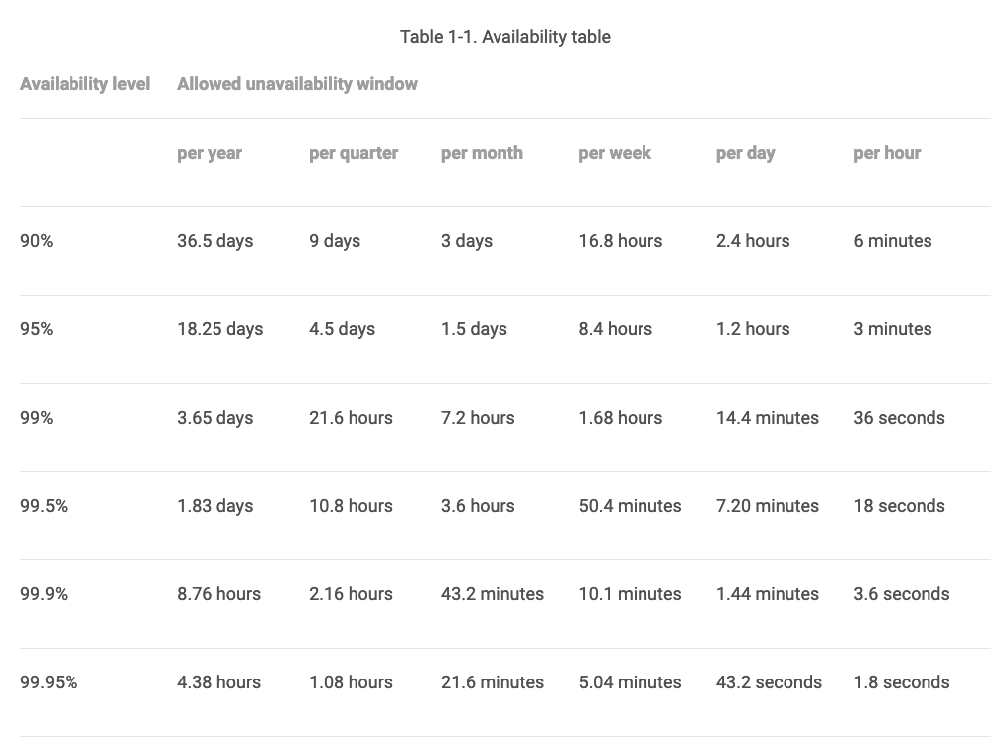

## Infrastructure Homework

_Notes:_

> The brief asked for an application/API to be coded.  As an infrastructure engineer, my coding expertise is in Terraform that hosts the application code, not the app code itself.  To highlight my thinking around infrastructure-as-code and the Terraform code that is the desired state of the infrastructure, I will complete the homework as an Ops team engineer who is responsible for the infrastructure code.
> I would like to add additional thoughts to the brief around the discipline of coding from an application and infrastructure point of view.
> Using Boeing as the scenario (787 specifically), we have engineers that design the wing structures and we have engineers that assemble the wing structures.  
> * Both engineers are the worlds leading knowledge holders on Boeing 787 wing structures. 
> * Neither engineer would be able to do the others skillset.
> * The wing structure engineer uses computers to design, engineer, test, and ship the plans to build the wings.
> * The wing assembly engineer uses tools to prepare, assemble, fasten, test, and ship the assembled wings.
> * The wing structure engineer could not use the tools of the assembly engineer as effectively as the that engineer can.
> * The wing assembly engineer could not use the computers of the structure engineer as effectively as that engineer can.
> * Although both engineers are equally knowledgeable on the wing structure of the 787 they should not attempt to do each others jobs and instead should focus on their skillset and tooling set that gets the best wing built and shipped to the customers.

---

### String Return Application Specs

Description: A non-critical API service to be utilized by already existing internal services.  Accepts and returns ASCII strings on a TCP port.

#### Customers

_Internal services_

#### Requirements

* _internal customers = 90% SLO_
* _external customers = 99.95% SLO_
* _Accepts and returns responses across the network using TCP_

#### Dev Env 

_How to use the development environment_

Dev Env guidelines:

* VM access is via an SSH Tunnel over GCP IAP using your Google Identity credentials
* Github access is via normal web access to the private repo
* Absolutely no direct access via the internet is allowed in the dev environment, firewalls are locked down and cannot be opened under any circumstances
* All infrastructure will be via the desired state in Terraform code
* Use your personal sandbox for experimentation's as the dev env is an integration point for the infra and the application

#### Container build

To build & ship containers in the dev env follow these steps:

1. Checkin container build specs to Git
2. Git checkins will trigger a Cloud Build job to build the spec'd container
3. The built container will be stored on the artifact shelf of GCR
4. The container can then be pulled from the GCR registry into a running HashiStack VM
5. The HashiStack VM is baked via Packer so any changes needed must be checked into the Packer Git repo

#### VM access

To SSH into the running VM in the dev env follow these steps:

1. Login to the GCP Web Console using your company credentials
2. From the GCP Web Console navigate to the GCE VM console
3. From the VM access menu choose `View gcloud command`
4. Copy the `gcloud` command - ex. `gcloud beta compute ssh --zone "us-west1-c" "instance-1"  --project "simplifymycloud-dev"`
5. From your CLI which must be logged in via the SDK, run that `gcloud` command
6. A SSH Tunnel is now established to the dev env HashiStack VM using GCP IAP

#### Infrastructure desired state

To suggest any needed changes to the infrastructure, the following Git repos can be `git pull requested` to ask for the changes you need.

Refer to the [README](README.md) for a breakdown of where each infrastructure resource is defined, in either the Foundation Layer or the Service Layer.

#### Proposed production architecture

This is a working concept of the proposed production architecture. 

* Multi-regional MIGs (Managed VM Instance Groups) would serve traffic for the closest customers.
* Each MIG is self-scaling up and down
* Each MIG is self-healing
* External facing to the customers will be a GCP External Load Balancer, a single entry point into the GCP network
* The GCP LB will be fronted by GCP Cloud Armor to protect the outside perimeter from attacks

